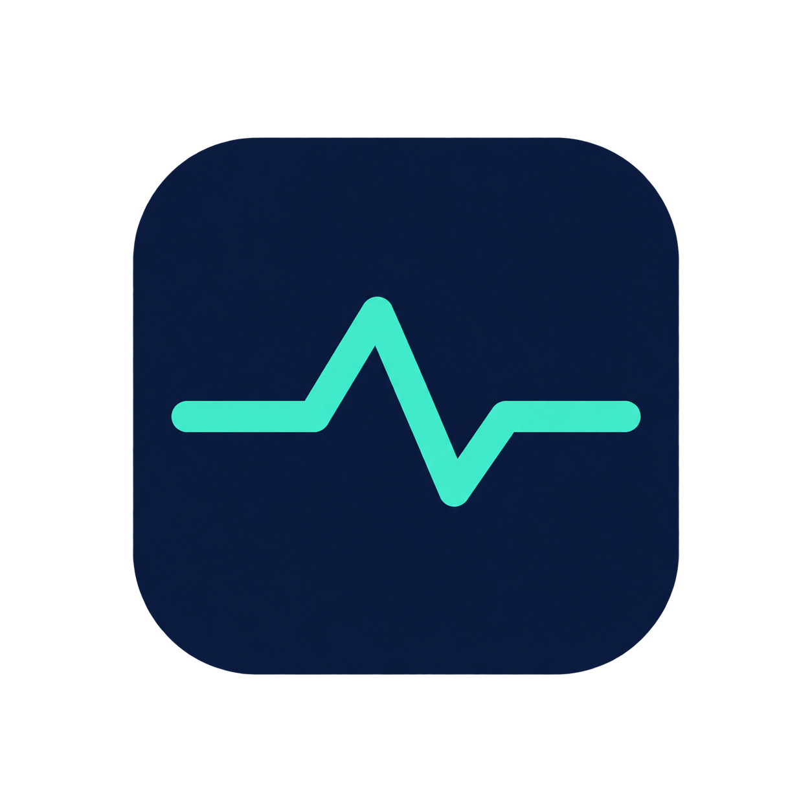

<p align="center"></p>
<h1 align="center">Qstats</h1>
<p align="center">轻量、免费、无需账号的 macOS 系统监控与截图工具。</p>


[](https://github.com/qg-hs/Qstats/actions/workflows/macos.yml)


## 功能

### 菜单栏监控

- 实时显示网络速度、CPU、内存和 GPU，默认全部开启。
- 任意选择 1–4 项，不需要重启，设置自动保存。
- CPU、内存、GPU 可分别使用精简圆环、圆角横条、竖条或百分比数字。
- 紧凑双行网速、固定宽度数字、浅色和深色外观。

### 截图与贴图

- 按 `Option + D`（默认，可自定义）或点击菜单栏「区域截图」。
- 多显示器、Retina 高分辨率截图和实时选区尺寸。
- 简洁毛玻璃标注栏：矩形、箭头、画笔、马赛克、文字、颜色、线宽和撤销。
- 复制 PNG、保存 PNG，或直接将截图置顶到桌面。
- 可将剪贴板图片贴到桌面；贴图支持拖动、滚轮缩放和 `Option + 滚轮`调透明度。
- 所有图片仅在本机处理，不上传，不需要账号。

首次截图时，macOS 会要求「屏幕与系统音频录制」权限。授权后重新启动 Qstats。平时的系统监控不会读取屏幕。

## 下载与安装

支持 **macOS 13 及以上**。从 [Releases 最新版本](https://github.com/qg-hs/Qstats/releases/latest) 按芯片下载：

| Mac | 安装包 |
| --- | --- |
| Apple Silicon：M1 / M2 / M3 / M4 | `Qstats-1.2.0-apple-silicon.dmg` |
| Intel | `Qstats-1.2.0-intel.dmg` |

打开 DMG，将 **Qstats.app** 拖到 Applications。应用为本地 ad-hoc 签名，尚未经过 Apple 公证；首次打开被拦截时，请在「系统设置 → 隐私与安全性」中选择「仍要打开」。

公开 Release 无需登录 GitHub。每个架构附带独立 SHA-256 校验文件。

## 使用截图

1. 按 `Option + D`，或从菜单栏点击「区域截图」。
2. 在任一显示器上拖出选区。
3. 选择标注工具并直接绘制；颜色和线宽按钮可循环切换。
4. 点击置顶、保存、复制或关闭。

快捷操作：

| 操作 | 快捷方式 |
| --- | --- |
| 开始截图 | `Option + D`（默认，可自定义） |
| 复制选区 | `Enter` 或双击选区 |
| 撤销标注 | `Command + Z` |
| 取消 | `Esc` |
| 缩放贴图 | 滚轮 |
| 调整贴图透明度 | `Option + 滚轮` |
| 关闭贴图 | 右键菜单或悬浮关闭按钮 |

在菜单栏「截图快捷键」中可直接录入任意包含 `Control`、`Option`、`Shift` 或 `Command` 的组合键，也可一键恢复默认 `Option + D`。设置会自动保存；若组合键已被系统或其他应用占用，Qstats 会保留原快捷键并提示。

文字工具使用轻量毛玻璃输入浮层和紧凑提示文字。选区及每种标注工具都有对应的高对比度鼠标指针；底部工具栏提供 hover、按下和选中反馈。保存 PNG 使用异步系统面板，不会阻塞截图窗口。

## 菜单栏设置

点击指标 →「菜单栏显示」，勾选网络速度、CPU、内存和 GPU。至少保留一项，避免入口消失。若设备无法读取 GPU，单独选择 GPU 时会显示「—」并保留菜单入口。

点击「显示样式」可分别设置 CPU、内存和 GPU：

| 样式 | 配置值 |
| --- | --- |
| 精简圆环（默认） | `circle` |
| 圆角进度条 | `bar` |
| 竖向进度条 | `vbar` |
| 百分比数字 | `text` |

## 高级配置

配置文件位于 `~/.config/qstats/config.yaml`。菜单修改显示和样式时，会保留手工设置的采样间隔、配色、图标和注释。

```yaml
cpu_interval: 2.0
memory_interval: 2.0
gpu_interval: 6.0
network_interval: 2.0

show_network: true
show_cpu: true
show_memory: true
show_gpu: true

cpu_style: circle      # circle | bar | vbar | text
memory_style: circle
gpu_style: circle

cpu_color: green       # green | orange | blue | red | purple | yellow | pink | teal
memory_color: orange
gpu_color: purple

cpu_icon: cpu
memory_icon: memorychip
gpu_icon: display
network_icon: network
```

首次启动时会自动从 `~/.config/stats/config.yaml` 或 `~/.config/osx-stats-nano/config.yaml` 迁移配置，旧配置不会被修改。

## 开发与打包

需要 macOS 13+、Xcode / Command Line Tools（Swift 5.9+）。

```bash
git clone https://github.com/qg-hs/Qstats.git
cd Qstats
swift test
./run.sh

# Apple Silicon
./package.sh arm64

# Intel
./package.sh x86_64
```

版本来自根目录 `VERSION`。打包只生成当前指定芯片的 `.app` 和 DMG，不制作 Universal 包。

GitHub Actions 使用两个原生 runner 分别执行测试、编译、架构校验和启动检查：

- Apple Silicon runner 生成 `Qstats-1.2.0-apple-silicon.dmg`
- Intel runner 生成 `Qstats-1.2.0-intel.dmg`
- 两边都成功后才自动发布 GitHub Release
- 已发布的相同版本不会被后续提交覆盖

## 代码结构

| 文件 / 目录 | 用途 |
| --- | --- |
| `Sources/Screenshot/` | 快捷键、屏幕采集、区域选择、标注和贴图 |
| `Sources/AppDelegate.swift` | 生命周期、监控菜单和截图入口 |
| `Sources/AppConfig.swift` | 配置读取、迁移和保存 |
| `Sources/StatusBarController.swift` | 菜单栏动态布局 |
| `Sources/Widgets/` | 系统指标控件 |
| `Sources/Monitors/` | Mach、BSD 和 IOKit 监控 |
| `Tests/MonitorTests/` | 监控、设置、绘制与截图模型测试 |
| `.github/workflows/macos.yml` | 双芯片构建与自动发布 |

问题反馈：[GitHub Issues](https://github.com/qg-hs/Qstats/issues)。版本变化见 [CHANGELOG.md](CHANGELOG.md)。

## 致谢与许可证

特别认可并致谢 [LINUX DO](https://linux.do) 社区。详见 [LICENSE](LICENSE)。
